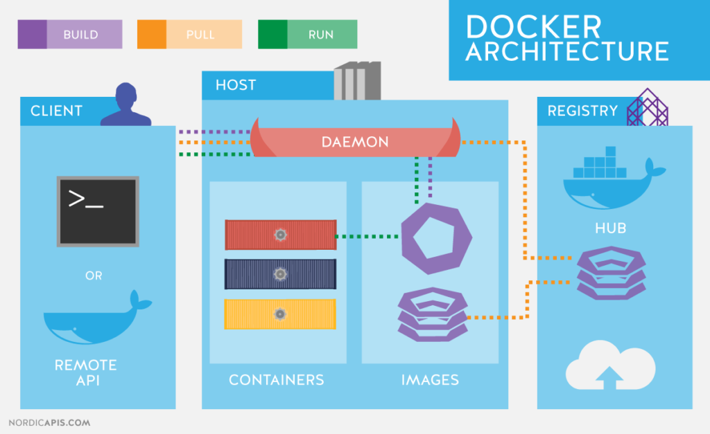
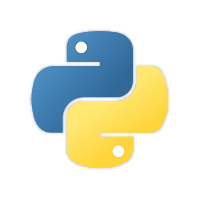

----------------------
# COCOTB
## Testbench en Python
----------------------

### Andres Demski
##### Satellogic

---

## Agenda: Introducción
-----------------------
- Puesta en marcha de PCs
- Introducción al SW
- Introducción a Python

----

## Agenda: Básico
-----------------

- Testbenchs:
    - Flujo de trabajo
    - Por que hacerlos?
    - TB en lenguajes HDL
- COCOTB:
    - Arquitectura
    - Modo de uso
    - Corrutinas
    - Practica y ejemplos
    
----

## Agenda: Avanzado
-------------------
- Estructuras de test y portabilidad
    - Driver
    - Monitores
    - Interfaces
- Practicas
    - AXI Stream
    - AXI4 Lite
    - SPI
---

## Software necesario
---------------------

<ul>
<span class="fragment (appear)" data-fragment-index="1"><li>
python
</li><span class="fragment (appear)" data-fragment-index="2"><li>
cocotb
</li><span class="fragment (appear)" data-fragment-index="3"><li>
iverilog / ghdl
</li><span class="fragment (appear)" data-fragment-index="5"><li>
gtkwave
</li><span class="fragment (appear)" data-fragment-index="6">
<p style="text-align: center;">
</p><p style="font-size: 3em; text-align: center;">
**Docker**
</p>
</ul>
----

# Instalación clásica
---------------------

<p style="text-align: center;"> (para el que no quiera usar docker) </p>

----

### GHDL e iverilog
```bash
sudo apt-get install iverilog
git clone https://github.com/tgingold/ghdl.git ghdl_src/ && cd ghdl_src && \
    ./configure --prefix=/usr/local --with-llvm-config && make && \
    sudo make install && cd ..
```

### GTKwave

```bash
sudo apt-get install gtkwave
```

### cocotb

```bash
pip install cocotb
```

----

# 
-----------------------------
# Docker
-----------------------------

----

### Que es Docker?



----

### Instalación
------------------
```bash
curl -fsSL https://get.docker.com -o get-docker.sh
sudo sh get-docker.sh
sudo usermod -aG docker your-user
# log out and back in
```
------------------

----

### Preparando las herramientas...
----------------------------------

Crear imagen
```bash
docker build -f .docker/Dockerfile -t spl2019 .
docker pull andresdemski/spl2019
```
Hello World
```bash
docker run andresdemski/spl2019 echo "Hello World"
```

----

Clonar el repositorio
```bash
git clone https://github.com/andresdemski/spl2019_cocotb.git
```

Setear el entorno
```bash
source utils/env.sh
```

Cocotb test
```bash
make -C ejemplos/cocotest
```

---

# 
-------------
# PYTHON
-------------

----

## Ventajas
* Opensource  
* Multiplataforma  
* Sintaxis sencilla  
* Escalable para grandes aplicaciones  
* Librerías y soporte en la comunidad  
* Garbage collector

-----
## Desventajas
* Rendimiento  

----

## Aplicaciones
---------------
* Web
* Backend
* Automatización
* DSP
* Simulación
* Inteligencia Artificial (ML, NN, LR, etc)
* Calculadora
* Manejo de base de datos
* Lenguaje "plasticola"

----

## Sintaxis
------
* No tiene fin de linea
* Case sensitive
* Bloques por identación
* Parecida a C y Matlab
------

----

## Tipos de datos
-----------------

* int  

```python
a = 5; a = 10; a = 1000000; a = 10000000000000000
```

* bool

```python
a = True
a = False
```

* float

```python
a = 5.1; a = 10.2e6; a = 1e6
```

* complex

```python
a = 1 + 1j; a = 10.2e6j; a = 1e3 + 1e6j
```

----

* string

```python
a = "Hola"
a = a + " Mundo " # "Hola Mundo "
b = a * 2 # Hola Mundo Hola Mundo
res = b.split(' ') # ["Hola", "Mundo"]
```
* bytes

```python
a = b"hola"
```
* list

```python
a = [11, 22, 33, 44]
a[0] # 11
a[3] # 44
a[-1] # 44
a[-2] # 33
a[0:2] # [11, 22]
```
----

* tuplas

```python
a = (11, 22, 33, 44)
```

* diccionarios

```python
a = {"a": 1, "b": 2, "hola": 3, 10: "hola" }
a["a"] # 1
a["b"] # 2
a["hola"] # 3
a[10] # "hola"
```

----

## Estructuras de control
-------------------------

```python
# If
if x < 0:
    print("x < 0")
elif x < 1:
    print("0 <= x < 1")
else:
    print("1 <= x")

# Comparaciones:
== , <=, <, >, >=, is, in, !=, or, and

# For
for i in iterable: # range(3), [0, 1, 2], (1, 2, 3), {"a":1, "b":2}.keys()
    print(i)

# With
with open('archivo.txt') as f:
    data = f.read()
```

----

### Funciones, generadores y clases
-----------------------------------
* funciones

```python
def funcion(arg1, arg2):
    res = arg1 + arg2
    return res
```  
* clases  

```python
class Complejo():
    def __init__(self, real, img):
        self.real = real
        self.img = img
    def abs(self):
        return (self.real**2 + self.img**2)**0.5

cplx = Complejo(1,1)
print(cplx.abs())
```

----

* Generadores

```python
def my_range(end):
    i = 0
    while i < end:
        yield i
        i += 1

gen = my_range(5)
next(gen) # 0
next(gen) # 1
...
next(gen) # 4
next(gen) # ERROR!

for i in my_range(5):
    print(i)
```
----

### Sintaxis extra
------------------

* List comprehensions

```python
a = [ 3*i for i in iter if condition]
```

* Funciones lambda

```python
my_pow = lambda x, p: x**p
my_pow(2, 3) # 8
```

----
### Errores
-----------
Excepciones y asserts

```python
raise Exception("Mensaje")

class MyException(Exception):
    pass

raise MyException("Mensaje")
assert a < 5, "Error si a no cumple la condición"
```
---------------

----

try, except, finally

```python
try:
    alguna_funcion_con_error()
except MyExeption:
    hacer_algo()
except:
    hacer_otra_cosa()
finally:
    hacer_siempre_al_final()
```
----------------------

---

----------------------
# Practicas de Python
----------------------

----

### Practica 1
--------------
```python
Hacer una clase que sea capaz de abrir un archivo de texto y
contar:

* Letras: obj.count('a')
* Lineas obj.count_lines()
* Palabras: obj.count_words()
# Recomendacion: import re; help(re);
```
-------------

----

### Practica 2
--------------
```python
Editar la clase anterior para que tenga un método que realice
cuantas veces se repiten las palabras (no case sensitive) 
retornando un diccionario:

obj.statistic()
# texto: Hola Mundo HOLA mundo hOlA hola
# return: {'hola':3, 'mundo':1,}
```
--------------

----

### Practica 3
--------------
```python
Usando el paquete time:
Hacer una clase TicToc para contar tiempos. Y almacene en una 
lista los periodos contados:

for i in range(3):
    obj.tic()
    time.sleep(i)
    elapsed = obj.toc() # returns the elapsed time

obj.get_elapsed_ times() 
# En este caso retorna [1.0012, 2.040, 3.008]
obj.get_start_times() 
# Retorna cuando se hicieron los tic en formato legible
```
--------------

---

------------
# Testbenchs
------------

----
### Flujo de trabajo
-------------------

#  <!-- .element height="50%" width="50%"-->

----

### Plataforma de test
----------------------
#  <!-- .element height="70%" width="50%"-->

----

### Simulaciones clásicas
----------------------
```verilog
module tb();
  reg [3:0] a, b;
  wire [3:0] out;
  core DUT (.a(a), .b(b), .out(out));
  initial begin
    a = 4'b0000;
    #20
    a = 4'b1111;
    ...
    b = 4'b1010;
    #20
    $finish;
  end
```
#  <!-- .element width="60%""-->

----

#### Problemas de los TB clasicos
--------------------------------

* Sintaxis poco amigable
* Capacidad reducida y complicada de comunicarse con otras aplicaciones
* Mantenimiento complicado
* Baja portabilidad
* La sincronización de eventos es complicada
* Se debe hacer un toplevel diferente al sintetizado para poder simular
* Frameworks (UVM, UVVM, OVM, OSVVM) dificiles de aprender

---

#  <!-- .element width="20%"-->
--------
# COCOTB
--------
### COroutine based COsimulation TestBench

----

### Arquitectura
----------------

#  <!-- .element width="100%"-->

----

### Como lanzar un test?
------------------------

#  <!-- .element width="60%"-->

```bash
make TESTCASE=hello_world MODULE=test_hello_world
```

----

#### Que pasa por atrás?
------------------------

#  <!-- .element width="100%"-->

---

### Como arrancamos?
--------------------

#### Makefile

```
# VERILOG/VHDL_SOURCES: Lista de archivos HDL
VERILOG_SOURCES=./example.v

# TOPLEVEL: Toplevel del diseño HDL
TOPLEVEL=example

# MODULE: Modulo de python a lanzar
MODULE=cocotest

# TESTCASE: Función de python que se va a correr (es opcional)
TESTCASE=hello_world,world_hello

# COCOTB_REDUCED_LOG_FMT: Para tener logs mas legibles
export COCOTB_REDUCED_LOG_FMT

# Importar los makefiles de cocotb
COCOTB=$(shell cocotb-config --makefiles)
include $(COCOTB)/Makefile.inc
include $(COCOTB)/Makefile.sim
```
----

#### Escribir un test
```python
import cocotb
from cocotb.triggers import Timer

@cocotb.test()
def hello_world(dut):
    cocotb.log.info("Hello World")
    yield Timer(1, units='us')
```
#### Make
```bash
make
```

----

---------
### Practica #1
Tomando como ejemplo el test ubicado en *ejemplos/cocotest*, hacer un
test desde cero escribiendo los archivos *Makefile* y *test.py*. 
Se puede usar cualquier archivo HDL que tengas o utilizar el del ejemplo.

--------

----

---------------------
## Sintaxis de COCOTB
---------------------

----
### Test

-----------
```python
@cocotb.test() # Etiqueta/decorador que indica que lo
               # siguiente es un test
def nombre_del_test(dut, parametros):
    # dut es el objeto que te va a permitir
    # tener acceso al HDL e interactuar con él
    ....
```
----------

----
### Asignación de señales
```python
dut.signal <= 1
dut.signal.value = 5

signal = dut.signal
signal <= 1 
signal.value = 5

dut.instancia.signal <= 1

instancia = dut.instancia
instancia.signal <= 1
```
----

### Lectura de señales
```python

a = dut.signal.integer # unsigned integer
a = dut.signal.signed_integer # signed ineger
a = dut.signal.binstr # str representation (z & x supported)
a = dut.signa.buff # bytes
```

----

### Cuando corre la simulación? yield!!

#  <!-- .element width="70%"-->

```python
@cocotb.test()
def test(dut):
    dut.signal <= 1
    cocotb.log.info(dut.signal)
    yield Timer(1, units='ns')
    dut.signal <= 0
    cocotb.log.info(dut.signal)
```

----

### Triggers
-------------

```python
yield Timer(1, units='ns') # Tiempo
yield RisingEdge(dut.clk) # Flanco ascendente
yield FallingEdge(dut.clk) # Flanco descendente
yield Edge(dut.clk) # Cualquier flanco
yield coroutine.join() # Fin de corrutina

evt = Event() # Crea un evento
...
yield evt.wait() # Espera a evt.set()

# Esperar la ocurrencia de un evento en una lista de eventos
timeout = Timer(100, units = 'ns')
trg = yield [RisingEdge(dut.clk), timeout]
if trg == timeout:
    ....
```

----

---- 
### Practica #2

Utilizando los fuentes en *practica/clock_gen*, hacer un test que genere
un clock de 10ns de periodo.

Utilizar el comando *make gtkwave* para ver las waveforms

---- 

----

### Corrutinas
--------------

##### Funciones que consumen tiempo de simulación (hacen yield)

```python
@cocotb.coroutine
def nombre_de_la_corrutina(argumentos):
    signal = alguna_signal_en_los_argumentos
    for _ in range(10):
        yield RisingEdge(signal)
```

----

---- 
### Practica #3

Realizar lo mismo que en la práctica #2 pero con una corrutinas. Utilizar
*TESTCASE* en lo posible.

```python
def testcase_practica2(dut):
    ...

def testcase_practica3(dut):
    yield clock_generator(cycles=10)

    for _ in range(10):
        yield clock_generator(cycles=1)
```
---- 

----

### Fork
--------

```python
# Lanzar una corrutina
cocotb.fork(corrutina(argumentos))

# Esperar a que termine
cor = cocotb.fork(corrutina(argumentos))
yield cor.join()

# Matar una corrutina
cor = cocotb.fork(corrutina(argumentos))
cor.kill()

# Clock
cocotb.fork(Clock(signal, periodo, units='ns').start())

```

----

---- 
### Práctica 4

Utilizar la cortina hecha en la practica #3 y hacer que corra en paralelo
al test. Hacer que el test espere la finalización de la corrutina.

---- 

----

---- 
### Practica 5

Hacer un test que genere estímulos y lea la salida del un sumador combinacional
(practica/sumador\_comb)

---- 

### Practica 6

Hacer un test que genere estímulos y lea la salida del un sumador secuencial
(practica/sumador\_sync)

---- 

----

## Resultados
------------

```python
if condicion:
    raise TestFailure('Falla el test')

if condicion:
    raise TestSuccess('El test finaliza sin fallas') 

if condicion:
    raise TestError('Falla pero reportando error')
```

----

---- 

### Practica 7

Modificar la practica 6 para que genere un error si la
salida no es la esperada

---- 

---

## Estructuras avanzadas

# 

----

### Driver
---------

Son los encargados de generar los estímulos.

```python

class AlgunDriver()
    def __init__(self, dut):
        self.clk = dut.clk
        self.signal_a = dut.signal_a

    @cocotb.coroutine
    def send(self, data):
        for d in data:
            self.signal_a <= d
            yield RisingEdge(self.clk)

@cocotb.test()
def test(dut):
    ...
    drv = AlgunDriver(dut)
    yield drv.send([i for i in range(10)])
    ....
    sending =  cocotb.fork(drv.send([i for i in range(100)])
    data = yield other_drv.recv(100)
    yield sending.join()
```

----

### Monitor
------------ 
Monitoreo de señales para generar señales de error y
obtención de la información útil para determinar el
funcionamiento.

```python
class AlgunMonitor()
    def __init__(self, dut):
        self.clk = dut.clk
        self.signal_a = dut.signal_a
        self.data = []

    @cocotb.coroutine
    def start(self, data):
        while True:
            yield RisingEdge(self.clk)
            self.data.append(self.signal_a.value.integer)

@cocotb.test()
def test(dut):
    drv_in = AlgunDriverInput(dut)
    drv_out = AlgunDriverOutput(dut)
    mon_in = AlgunMonitorInput(dut)
    mon_out = AlgunMonitorOutput(dut)

    sending =  cocotb.fork(drv_in.send([i for i in range(100)])
    cocotb.fork(drv_out.receiver())
    cocotb.fork(mon_in.start())
    cocotb.fork(mon_out.start())
    yield sending.join()
    
    data_in = mon_in.data
    data_out = mon_out.data
    if data_out != [2*d for d in data_in]:
        raise TestFaiule('La salida tiene que ser el doble de la entrada')
    ...
    
```

----

### Parametrizar test
----------

```python
@cocotb.coroutine # definir los test como corrutinas
def test_parametrizado(dut, parametro1, parametro2):
    ....
tf = TestFactory(test_parametrizado)
tf.add_option('parametro1', [1, 2])
tf.add_option('parametro2', ['hola', 'chau'])
tf.generate_tests()
```
--------

----

-------------
## Practica 8
A travez de vivado HLS se generó un bloque sumador con interfaces AXI Stream
de entrada y de salida. En este ejercicio se pide:
* Hacer drivers y monitores para axi stream
* Utilizar los driver y monitores para hacer un test que valide el comportamiento  

# 
-------------

----

--------------
## Practica 9
En este ejercicio se proporciona un periférico SPI posible de conectar a un bus
AXI4 lite.  
A partir de la plantilla de test *practica/axi_lite_spi*, completar los tests
propuestos para verificar su funcionalidad.

--------------

---
## Conclusiones
---------------
* COCOTB proporciona una interfaz amigable para hacer TB
* La potencialidad y portabilidad dependen del programador
* Buena opción cuando no se necesita rendimiento
---------------

---

--------------
## Preguntas ?
--------------

---

--------------
#  <!-- .element width="20%"-->
# Muchas gracias
--------------

